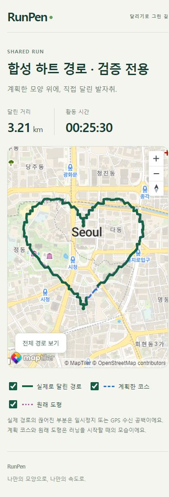
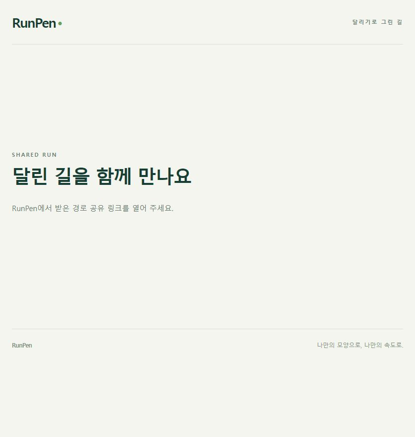
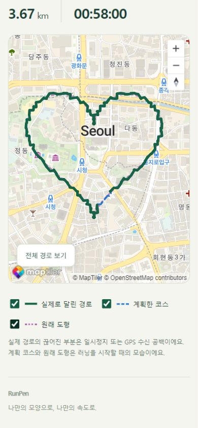

# 실제 러닝 경로 링크 공유 검증

검증일: 2026-10-04 (Asia/Seoul). [실행 계획](../history/executed-plans/2026-10-04-1636-run-link-sharing.md) · [사용법·계약](../development/run-link-sharing.md).

## 현재 상태

**사용자가 최종 지정한 ‘폰 연결 없이 가능한 범위’는 완료했다.** 앱 공유 흐름과 세 경로 표시 웹을 구현하고 기존 Supabase에 공유 SQL을 적용했다. 사용자가 직접 배포한 **https://runpen-shared-runs.ssw3131.workers.dev/** 에서 정적 파일·보안 헤더와 합성 기록의 실제 공유/지도/중단을 검증했다. 원본 앱의 공유 주소를 활성화했고, 후속 요청으로 **18:56:38 KST 휴대폰 SM-S942N에 동일 ID·서명 APK를 자료 유지 업데이트**했다. 기존 로그인·러닝 2건과 공유 확인창 취소를 확인했다. USB가 끊긴 뒤 사용자가 폰 없이 마무리를 요청해 추가 휴대폰 검증·임시 파일 정리는 후속으로 남겼다. 아래 미배포·미설치·승인 대기는 이전 시점의 이력이다.

## 통과한 검사

| 범위 | 결과 |
| --- | --- |
| 자동 검사 | 기존 포함 전체 337개 통과. 새 7개는 최소 공개 사본·출발 당시 계획/원형·공백·자료 오류·실제 SQLite 소유권·동기화/계정 변경·RPC 오류 검증 |
| 타입·린트 | `dev.ps1 check`와 새 모듈·웹·QA ESLint 통과. 추가로 실행한 `eslint .`는 기존 스크립트의 Buffer/__dirname 설정과 작업 사본에 없는 기존 QA 캐시 참조 때문에 실패. 이번 변경의 새 오류는 없음 |
| 로컬 PostgreSQL | PGlite에 기존 개인 기록·탈퇴·공유 마이그레이션을 적용해 소유자/익명 권한·중단/새 링크·원본 삭제/탈퇴 검증. 합성 자료 롤백 |
| 실제 Supabase | 합성 계정의 같은 SQL 검사 PASS. 롤백 후 계정 1개·개인 기록 4행·파일 3개·공유 0개. 개인 기록 전체 행의 정렬된 JSON 지문 전후 동일 |
| 실제 HTTP | 잘못된 토큰 익명 조회 200/null, 개인 기록/공유 목록 및 익명 공유 해제 접근 거부. 실제 경로는 조회/공개하지 않음 |
| 웹 화면 | 실제 MapTiler 배경 위 합성 하트 3개 경로·각 토글·전체 맞춤·모바일 초기 표시와 크기 변경 통과 |
| 빈 상태·실패 | 자유 러닝은 실제 경로 토글만 표시. 해제/없는 링크 안내·서버 오류/재시도·GPS 공백 확인 |
| Android | production Hermes export 성공. 네이티브 변경 없음. 공개 URL 활성화 후 새 빌드·실제 Android 공유 창 검증은 후속 |

서버 기록 지문: `781693c990a0e55a4610d9e0ba88d82c`. `personal_records` 전체 행을 대조했으며 Storage 파일은 개수만 재확인했다. 원래 GPS 파일은 열거나 다시 저장하지 않았다.

웹 화면 시험은 **명시적인 로컬 요청 대역과 합성 좌표**다. 사용자 실제 기록이나 배포 완료 증거가 아니다.

[실제 서버 권한 검사 PASS 화면](assets/run-sharing/server-authorization.png).

## 18:35 이후 사용자 직접 배포·앱 활성화 확인

- 실제 HTTPS 200, HTML/JS/CSS/공개 설정/robots 파일 대조 통과. `no-store`, `no-referrer`, `nosniff`, 프레임 차단, CSP, 검색 제외 확인. 공개 설정에는 공개 키만 들어 있다.
- 배포 설정을 사용한 실제 Supabase 익명 RPC와 CORS 통과. 없는 64자리 토큰은 `null`; 브라우저에서 기본 안내와 없는/중단된 링크 안내 표시 확인. 유효한 경로 표시 검증으로 간주하지 않는다.
- 원본 앱의 공개 공유 주소 설정. release 빌드 성공, APK 내부 Hermes 자산에 정확한 배포 주소 포함 확인. 기존 앱 ID `com.runningart.mobile.dev`, arm64·x86_64, 기존 인증서 SHA-256 `fac61745dc0903786fb9ede62a962b399f7348f0bb6f899b8332667591033b9c` 유지.
- APK `build/install/running-art-0.1.0-20261004-run-sharing.apk`: 96,916,458바이트, SHA-256 `0a5cd7b065872df133fecd489121adc708f5aaddb8406efe706d61c979727b06`.
- API 36 에뮬레이터에 자료 유지 업데이트·앱 cold start·러닝 목록 표시 통과. 목록은 기존부터 빈 상태였다. 부팅 직후 System UI 응답 지연은 대기를 선택한 후 회복했고 기본 UIAutomator로 화면을 확인했다. 로그인된 공유 창 검증으로 간주하지 않는다. 추가 루트 권한 없이 확인했고 직접 만든 UI 임시 파일 정리·에뮬레이터 종료를 마쳤다. [실행 화면](assets/run-sharing/android-enabled-launch.png).
- 공유 관련 7개 회귀 검사와 추가 hosted QA 스크립트 ESLint 통과. 배포 확인 스크립트가 설정 키 이름을 처음 잘못 가정해 실패했고 실제 `publicKey`/`schemaVersion` 계약으로 고친 후 통과했다. 제품 파일은 변경하지 않았다.
- `scripts/qa/run-sharing-hosted.mjs`에 임시 계정 1개와 합성 하트만 사용하는 실제 SQLite→동기화→공유/익명 조회→중단→기존 탈퇴 API 정리 절차를 준비했다. 초기 SQL은 자동 승인 검토가 거절해 입력/실행되지 않았으며 계정·공유 자료는 생성하지 않았다. `publish`/`revoke`/`cleanup`은 미실행이다.

## 18:52 이후 휴대폰 후속·승인된 실제 통합 검증

사용자가 폰 연결·검증을 요청했고, 이어 **임시 계정 생성·검증·정리**를 명시적으로 승인했다. 기존 개인 GPS 대신 격리된 임시 계정과 수학적으로 만든 하트만 사용했다.

- 실제 앱 SQLite 저장/코스 사본/일시정지 → 기존 동기화 컨트롤러 → Supabase 비공개 파일/요약 → 실제 공유 서비스/RPC → 익명 공개 사본의 내용 일치 통과. 232개 좌표, 2개 구간, 계획 코스와 원래 도형을 확인했다. 같은 기록 재시도는 같은 링크였다.
- 실제 Cloudflare 페이지에서 MapTiler 배경·세 레이어·개별 토글·전체 경로 보기를 확인했다. 390×844 모바일 크기의 정상 뷰포트 스크린샷을 보존했다. 전체 페이지 캡처는 캡처 중 viewport/vh 변화로 왜곡돼 검증 근거에서 제외했다. 제품 CSS/JS 문제로 판단하거나 수정하지 않았다.
- 19:02:38 소유자 API로 공유 중단 후 익명 조회 `null`, 기존 웹 링크에 열 수 없음 안내 확인.
- 19:03:02 기존 탈퇴 API로 임시 계정·합성 코스/러닝·파일을 제거하고 재로그인 불가와 삭제 완료 확인. 임시 로컬 인증 파일/SQL도 제거했다.
- 서버는 전후 계정 1개·개인 기록 4행·파일 3개·공유 0개. 이번 동일 쿼리로 비교한 기록 지문은 전후 `79a9c9b2c43eb8a5569fd0a0d6b51cf3`으로 일치한다. 앞선 지문과 집계 문자열 방식이 달라 이전 값과 직접 비교하지 않는다.
- 휴대폰은 기존 Google 이름/이메일, 러닝 2건/66+143좌표의 목록 표시를 유지한다. appId·최초 설치 시각·데이터 경로/inode 유지 확인. 실제 기록의 공유 확인창에서 취소했고 공유 없음 상태가 유지됐다. **실제 사용자 GPS를 공개하지 않았다.**
- 별도 QA APK 설치와 DB 추출은 자동 승인 검토가 거절해 실행하지 않았다. 화면/설치 정보 비교만 수행했으며 이번 휴대폰 내부 DB 전체 내용 해시 검증으로 보고하지 않는다.
- Android 공유 선택창을 합성 URL로 별도 확인하려던 시점에 USB 연결이 끊겼다. 해당 명령은 기기 없음으로 실행되지 않았다. 실제 RunPen 버튼에서 OS 공유 선택창까지의 검증과 최종 코스·메모·동기화 대조/임시 화면 파일 정리는 재연결 뒤 남아 있다.

[공유 중단 화면](assets/run-sharing/hosted-revoked.png) · [테스트 계정 정리 후 서버 개수/지문](assets/run-sharing/hosted-cleanup.png).

## 이번 완료 범위 밖의 휴대폰 후속

사용자 19:06 후속 지시로 이번 마무리 범위에서 제외했다. 다음 휴대폰 검증 시 코스/메모/동기화 상태 최종 대조와 이번 `/sdcard/runpen-share-ui.xml`, `/sdcard/runpen-share-screen.png`만 정리한다. 실제 기록 공개를 수반하는 RunPen→OS 공유 창 검증은 임의로 수행하지 않는다. 합성 테스트 계정/서버 자료 정리는 끝났으며 PC·서버·웹에 남은 필수 검증은 없다.

### 이전 승인 대기 사유

당시 자동 승인 검토는 임시 계정 생성 SQL의 합성 자료·정리 범위에 대한 명시적 승인이 없다는 이유로 거절했다. 이후 사용자가 해당 범위를 승인했고 위 실제 통합 시험·정리를 완료했다. 현재 추가 서버 승인은 필요 없다.
