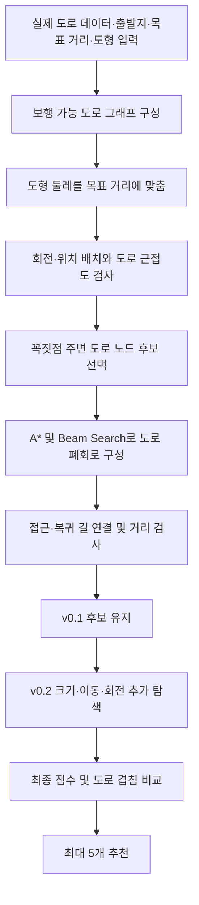

# 도형을 따라 달리는 코스 탐색 알고리즘 — 상세 명세와 소스 안내

작성일: 2026-09-22  
대상 코드: Running Art v0.2의 `route-engine.js`  
범위: **도로 그래프 위의 도형 코스 탐색만**. 모바일 UI, 서비스 배포, 이미지 업로드, 난이도 계산은 다루지 않는다.

## 1. 문제 정의 및 코드 묶음

입력은 출발 위경도 O, 목표 거리 T, 탐색 반경 R, 닫힌 도형 점열 S, 보행 도로 데이터 W다. 출력은 출발 도로점으로 돌아오는 실제 연결 경로 중 도형과 닮은 코스 최대 5개다.

이는 제한 조건이 있는 그래프 경로 탐색과 도형 정합 문제다. GPU·AI API·모델 학습을 요구하지 않는다. 휴리스틱 탐색이므로 전체 가능한 코스 중 수학적인 전역 최적해를 보장하지 않는다.

동봉한 소스는 서비스의 핵심 엔진을 그대로 복사했다. 실행기와 예제·테스트만 독립 실행에 맞춰 구성했다.

```text
running-art-algorithm/
  ALGORITHM.md              # 이 상세 명세
  README.md                 # 빠른 실행 안내
  package.json              # 외부 패키지 의존성 없음
  cli.js                    # JSON 입력 → 결과 JSON 및 GeoJSON
  src/route-engine.js       # 실제 현재 엔진, 원본 그대로
  src/route-worker.js       # 브라우저 Web Worker 진입점, 원본 그대로
  examples/grid.json        # 실행 검증용 가상 격자 도로(실제 지도 아님)
  tests/route-engine.test.js
  tests/refinement.test.js
  SHA256SUMS.txt            # 배포 파일 무결성 확인용
```

Node.js 22 이상 권장. ZIP을 푼 뒤 해당 폴더에서 실행한다.

```bash
npm test
npm run demo
# output/demo.json 및 output/demo.geojson 생성

node cli.js examples/grid.json output/custom.json 0.1
# 같은 입력을 고정 크기 방식으로 실행
```

`npm install`이나 API 키가 필요 없다. 예제는 가상의 도로이며 현실에서 달릴 코스로 사용하면 안 된다. 실제 OSM 도로를 입력하면 같은 엔진이 실제 도로망을 분석한다.

## 2. 핵심 원리: 지도에서 도형 모양의 코스를 찾는 방법

### 2.1 쉬운 설명

지도 위에 투명한 하트 종이를 올려놓는다고 생각하면 된다.

1. 종이의 하트 둘레를 5km에 맞춘다.
2. 하트를 회전하거나 주변으로 옮겨 도로와 겹치는 위치를 찾는다.
3. 하트의 각 꼭짓점 주변에서 실제 교차로·도로상의 점을 고른다.
4. 고른 점들을 실제 도로를 따라 차례로 연결한다.
5. 출발지에서 하트에 접근하고 다시 돌아오는 길까지 붙인다.
6. 실제 완성된 길이 하트와 얼마나 닮았는지 점수를 매긴다.
7. 비슷한 경로를 중복으로 추천하지 않도록 걸러 최대 5개를 보여준다.

**지도 이미지를 AI가 보고 하트를 인식하는 방식이 아니다.** 도로를 좌표와 연결 관계로 바꾼 그래프 위에서, 도형의 배치를 탐색하고 실제 경로를 평가한다.

### 2.2 전체 처리 흐름



도로 데이터 취득은 이 알고리즘 밖의 작업이다. 이 배포 묶음은 준비된 OSM 형식 데이터를 받아 계산하며, 외부 지도 API·UI·배포 기능은 포함하지 않는다.

### 2.3 데이터 표현

도형은 닫힌 점 목록이다. 마지막 점은 첫 점과 같다.

```js
[
  {x: 0, y: -2},
  {x: 1, y: -2},
  // ...
  {x: 0, y: -2}
]
```

도로는 OpenStreetMap `way` 자료다.

```js
{
  type: 'way',
  id: 123,
  nodes: [101, 102, 103],
  geometry: [
    {lat: 37.57, lon: 126.97},
    {lat: 37.571, lon: 126.971},
    {lat: 37.572, lon: 126.972}
  ],
  tags: {highway: 'residential'}
}
```

주의: OSM geometry의 경도 키는 `lon`, 앱 출발점의 경도 키는 `lng`다.

그래프:

```text
node: {id, x, y, links, turn}
edge: {a, b, length, tags}
link: {to, length, id}
graph: {nodes, edges, grid, cell, origin, reachable?}
```

### 2.4 위경도를 미터 좌표로 변환

광화문역 등 사용자가 지정한 시작 좌표를 원점으로 한다.

```text
latMeter = 111195
lngMeter = 111195 × cos(originLatitude)

x = (longitude - originLongitude) × lngMeter
y = (originLatitude - latitude) × latMeter
```

- x 양수는 동쪽, y 양수는 남쪽이다. 화면 좌표와 유사하다.
- 소규모 지역을 위한 근사 투영이다.
- 도형의 크기와 도로 거리 모두 같은 미터 좌표계에서 계산한다.
- 위경도 각도 단위와 미터를 직접 비교하면 안 된다.

### 2.5 보행 가능 도로와 연결망

`runnable()`이 필터링한다.

허용 도로 유형에는 residential, living_street, service, unclassified, tertiary, secondary, pedestrian, footway, path, track, steps 등이 있다. primary 및 cycleway 등은 명시적인 보행 허용 조건을 추가로 확인한다.

제외 예:

- `foot=no/private/use_sidepath`
- `access=no/private`
- `indoor=yes`, `area=yes`, construction
- 조건부 접근 속성이 존재하는 도로
- 보도가 없고 명시적 보행 허용도 없는 도로

핵심 연결 원칙:

- **같은 OSM node ID를 공유할 때만 서로 다른 도로를 연결한다.**
- 지리적으로 가깝거나 화면에서 교차한다고 무조건 연결하지 않는다.
- 교량 위·아래 길이나 근접한 평행 도로가 가짜 교차로가 되어서는 안 된다.
- 긴 도로 구간은 약 40m 이하로 나눠 스냅 가능한 중간 노드를 만든다.
- 중간 노드는 `way ID + 원래 구간 번호 + 분할 번호`로 식별한다. 다른 도로와 합쳐지지 않는다.
- 보행 방향은 `oneway:foot`를 반영한다. 자동차 일방통행을 그대로 도보에 강제하지 않는다.
- 탐색 반경 밖 끝점을 가진 원래 구간은 그래프 구성 시 제외된다. 경계에서 도로를 정확히 잘라내는 구현은 아니다.
- 공간 검색용 격자 크기는 100m다.

### 2.6 시작점을 도로에 붙이기

`search()`는 원점에서 100m 이내의 가장 가까운 그래프 노드를 시작점으로 선택한다.

- 100m 안에 연결 가능한 노드가 없으면 위치 재지정을 요청한다.
- 스냅된 노드에서 방향성을 고려해 도달 가능한 노드를 탐색한다.
- 이후 후보 스냅은 이 도달 가능한 집합으로 제한한다.
- 실제 추천 코스의 시작·끝은 **사용자가 찍은 임의 좌표가 아니라 스냅된 도로 위 점**이다.
- 사용자 좌표와 도로점 사이의 간격은 `snapMeters`로 표시하며, 이 간격을 가짜 도로로 연결하지 않는다.

### 2.7 도형 크기 결정

도형의 원래 둘레를 `P`, 목표 거리를 미터로 바꾼 값을 `T`라 하면:

```text
scale = T / P
```

픽셀 하트의 원래 둘레는 30, 가로 8, 세로 6이다.

5km 예:

```text
T = 5000m
scale = 5000 / 30 ≈ 166.67m
가로 = 8 × 166.67 ≈ 1333m
세로 = 6 × 166.67 ≈ 1000m
```

중요: 5km는 도형을 맞추는 **기준 둘레**다. 도로 우회 및 왕복 접근을 붙인 실제 코스가 정확히 5.000km가 된다는 의미는 아니다. 현재 실제 총 거리의 허용 범위는 목표의 75~125%다.

### 2.8 회전·이동 변환

각 점에 아래 변환을 적용한다.

```text
x' = tx + scale × (x cosθ - y sinθ)
y' = ty + scale × (x sinθ + y cosθ)
```

- θ: 도형 회전각
- tx, ty: 도형 중심 위치 조정
- scale: 도형 크기
- v0.2에서 도형이 움직이는 것과 사용자의 출발점이 움직이는 것은 다르다. 한 번의 탐색 중 사용자의 출발점은 고정된다.

## 3. v0.1 배치 탐색: 비싼 길찾기 전에 후보를 줄이기

도형을 놓을 수 있는 모든 배치에서 A*를 수행하면 너무 느리다. 먼저 저렴한 도로 근접도 검사로 후보를 좁힌다.

### 3.1 넓은 탐색

1. 0~345도를 15도 간격으로 회전한다. 총 24방향이다.
2. 기준 도형을 둘레를 따라 33개 점으로 재표본화하고, 중복 끝점을 뺀 32개를 앵커로 사용한다.
3. 회전한 각 앵커가 출발 도로점에 닿도록 배치한다.
4. 출발지 주변 격자 위치에도 도형을 배치한다.

격자 간격과 범위:

```text
step = max(250m, T / 12)
reach = min(사용자 탐색 반경, 0.7 × T)
```

5km 기준 격자 간격은 약 417m다.

### 3.2 빠른 배치 평가

각 배치에 대해:

- 도형 꼭짓점이 사용자 탐색 반경 밖이면 제외한다.
- 도형을 둘레 기준 33개 점으로 재표본화한다.
- 각 점에서 180m 이내의 도달 가능한 도로 노드를 찾는다.
- 한 점이라도 찾지 못하면 제외한다.
- 출발 도로점과 후보 노드들 사이의 최소 직선거리를 `approach`로 잡는다.
- `2 × approach > 0.35 × T`이면 제외한다.
- 배치 오차를 다음과 같이 계산한다.

```text
placementError = 평균(도형 표본점과 가까운 도로 노드의 거리)
                 + 0.10 × approach
```

이 값은 **후보를 줄이는 값**이며, 최종 유사도 점수가 아니다. 도로 근처에 점이 많아도 실제로 연결되는 경로가 없을 수 있다.

### 3.3 고정 크기의 국소 탐색

- 오차가 작은 상위 24개 배치를 고른다.
- x/y를 각각 -100, 0, +100m로 변경한다.
- 회전각을 -5, 0, +5도로 조정한다.
- 크기는 바꾸지 않는다.

따라서 v0.1도 단순 회전만 하는 구현은 아니다. 위치 탐색과 국소 회전 조정이 이미 있고, v0.2의 추가점은 크기 조정과 결과 기반 추가 탐색이다.

### 3.4 실제 경로 검증 대상 선정

배치 오차순으로 정렬하되 비슷한 장소·각도가 전부 차지하지 못하게 제한한다.

- 위치 약 250m, 각도 약 30도 버킷.
- 버킷당 최대 2개.
- 실제 도로 연결 검증은 최대 200개 배치.

## 4. 도형 꼭짓점을 실제 도로 코스로 바꾸기

### 4.1 꼭짓점별 교차로 후보

`nearbyTurns()`는 각 도형 꼭짓점 주변에서:

- 230m 이내의 교차로 또는 굽은 노드를 찾는다.
- 최소 2개의 링크가 있는 노드를 우선 사용한다.
- 후보끼리는 35m 이상 떨어지도록 선택한다.
- 꼭짓점당 최대 5개 후보를 사용한다.
- 없으면 180m 이내의 일반 도로 노드 하나로 대체한다.

`turn`은 노드의 서로 다른 이웃 수가 2가 아니거나, 이웃 방향의 코사인 값이 -0.85보다 클 때 지정된다. 이는 정확한 도로 교차로 분류가 아니라 스냅 후보를 위한 휴리스틱이다.

실제 경로 연결에는 원래 도형 꼭짓점을 사용한다. 긴 직선 변의 중간마다 강제로 도로점에 붙이지 않는다. 불필요한 지그재그 우회를 줄이려는 선택이다.

### 4.2 A* 경로 찾기

`shortestPath()`는 다음 점까지 실제 도로만 따라간다.

```text
g = 지금까지 실제 이동 거리
h = 현재 노드에서 목표 노드까지의 직선거리
f = g + h
```

- 최소 힙으로 f가 작은 노드를 먼저 처리한다.
- 보행 방향성을 지킨다.
- 거리 예산을 넘는 경로는 탐색하지 않는다.
- 길이 없으면 빈 경로를 반환한다.
- 연결 실패 시 직선으로 메우지 않는다.

### 4.3 Beam Search로 꼭짓점 선택 조합 줄이기

각 꼭짓점에 후보가 5개라면 조합 수가 폭발한다. 그래서 매 단계에서 유망한 연결 3개만 남긴다.

1. 첫 꼭짓점의 최대 3개 후보에서 시작한다.
2. 다음 꼭짓점 후보까지 A*로 연결한다.
3. 아래 비용을 누적한다.

```text
누적 비용 += 연결 경로 길이
          + 1.5 × 꼭짓점과 스냅 노드 사이 거리
          + 2 × 다시 지나간 구간 길이
```

첫 시작 후보에도 스냅 거리의 1.5배 비용을 준다.

4. 전체 도형 경로가 최대 허용 거리 `1.25 × T`를 넘으면 제외한다.
5. 비용순으로 최대 3개 상태만 유지한다.
6. 마지막 꼭짓점에서 첫 꼭짓점으로 도로를 따라 돌아가 폐회로를 만든다.

연속 꼭짓점 사이 A* 거리 상한은 다음과 같다.

```text
min(전체 허용 거리, 두 노드 직선거리 × 4 + 400m)
```

이 제한 때문에 매우 크게 돌아가야 하는 도로 연결은 실제로 존재해도 탐색되지 않을 수 있다.

### 4.4 출발점에서 도형까지 접근 경로 붙이기

도형 폐회로가 만들어지면:

1. 폐회로의 노드 중 출발점과 가까운 6개 진입점 후보를 고른다.
2. 출발 도로점 → 진입점 경로를 찾는다.
3. 진입점에서 도형을 한 바퀴 돈다.
4. 진입점 → 출발 도로점 복귀 경로를 따로 찾는다.
5. 가능한 진입점 조합 중 총 거리가 가장 짧은 것을 선택한다.

왕복 경로를 따로 찾는 이유는 보행 일방통행 등의 방향성이 있을 수 있기 때문이다.

### 4.5 최종 유효성 검사

```text
0.75 × T ≤ 실제 전체 코스 길이 ≤ 1.25 × T
반복 통과 구간 거리 / 전체 코스 길이 ≤ 0.30
```

- `loop`: 도형 부분.
- `access`: 도형까지 가는 길과 돌아오는 길.
- `route`: 접근 + 도형 + 복귀를 모두 합친 실제 전체 코스.
- 모양 유사도는 주로 `target`과 `loop`를 비교한다.
- 거리 적합도와 반복 구간 평가는 전체 `route`를 사용한다.

## 5. 최종 유사도 점수의 정확한 계산

### 5.1 비교 좌표계

- 목표 도형과 실제 도형 구간을 각각 64개 점으로 재표본화한다.
- x, y를 모두 사용자의 목표 거리 T로 나눈다.
- 각 경로를 따로 중심 이동하거나 가로·세로를 따로 정규화하지 않는다.

따라서 작거나 엉뚱한 위치의 길이 모양 비율만 닮았다고 만점이 되지 않는다. 각 후보의 변환된 목표 윤곽과 해당 도로 경로가 실제 같은 위치·크기에서 비교된다.

### 5.2 윤곽 점수: 양방향 Hausdorff 거리

A의 각 점에서 B의 가장 가까운 점까지 거리를 구한 뒤, 그중 최댓값을 택한다. 반대 방향도 계산한다.

```text
H = max(directedHausdorff(A,B), directedHausdorff(B,A))
contour = clamp01(1 - H / 0.09)
```

한 부분이 심하게 벗어나면 점수가 내려간다. 연속 선분에 대한 정밀 Hausdorff가 아니라 64개 표본점 사이의 이산 비교다.

### 5.3 진행 흐름 점수: Discrete Fréchet 거리

도형을 따라가는 순서를 유지하면서 두 점열 사이의 거리를 계산한다.

```text
flow = clamp01(1 - discreteFrechet(A,B) / 0.12)
```

단순히 같은 점 근처를 지나는 것과, 같은 순서로 윤곽을 따라가는 것을 구별한다.

주의: 현재 구현은 폐곡선의 모든 시작 인덱스나 역방향을 자동으로 최적 정렬하지 않는다. 도형 꼭짓점 순서와 경로 구성 순서에 영향을 받는다.

### 5.4 꺾임 패턴 점수

- 각 경로를 42개 점으로 재표본화한다.
- 가운데 40개 위치에서 진행 방향의 변화량을 구한다.
- 각도 차이는 0~π 범위의 절댓값으로 처리한다.

```text
angles = clamp01(1 - 평균 각도 차이 / (π × 0.65))
```

꺾임의 강도는 비교하지만 좌회전·우회전 부호 자체는 이 함수에서 비교하지 않는다.

### 5.5 거리 적합도

```text
distanceFit = clamp01(1 - |실제 전체 거리 - T| / (0.25 × T))
```

정확히 목표 거리면 1, 허용 범위 경계에서는 0이다.

### 5.6 반복 구간 감점과 총점

```text
reuse = 반복 통과 거리 / 실제 전체 거리

rawScore = 100 × clamp01(
    0.45 × contour
  + 0.25 × flow
  + 0.20 × angles
  + 0.10 × distanceFit
  - 0.20 × reuse
)

displayedScore = round(rawScore)
```

반복 구간은 방향과 무관한 노드 쌍으로 식별한다. 같은 구간을 돌아오는 경우도 반복에 포함된다.

**80점은 실제 도형 일치율 80%가 아니다.** 휴리스틱 가중 점수이며 후보끼리의 상대 비교에 사용한다. 순위는 표시용 정수 점수가 아니라 반올림 전 `rawScore`로 정한다.

### 5.7 중복 코스 제거

```text
overlap = 공통 도로 구간 길이 합
          / min(코스 A의 고유 도로 길이, 코스 B의 고유 도로 길이)
```

- 점수가 높은 순서로 처리한다.
- 이미 선택한 코스와 겹침 비율이 80% 이상이면 제외한다.
- 최대 5개를 남긴다.
- 조건에 맞는 서로 다른 경로가 적으면 5개보다 적게 보여준다.
- 이 중복도는 전체 경로의 고유 도로 구간 집합을 기준으로 한다.

## 6. v0.2: 크기·위치·각도의 추가 탐색

### 보존 원칙

v0.1의 최대 200개 실제 경로 검증을 먼저 모두 수행하고 후보를 유지한다. 그 후 추가 탐색 결과를 합친다.

동일한 입력 도로 그래프와 동일한 출발지·설정에서라면, 후보를 추가하는 것만으로 최고 평가 점수가 떨어지지는 않는다. 데이터가 바뀌었거나 출발지가 달라졌을 때까지 보장하는 것은 아니다.

### 1차 추가 탐색

시드:

- 실제 경로 점수가 좋은 후보 중 공간·각도 다양성을 고려해 최대 8개.
- 빠른 배치 오차가 좋은 후보 중 같은 방식으로 최대 8개.

각 시드에 적용:

```text
크기 배율: 0.88, 0.94, 1.00, 1.06, 1.12
이동(m): (0,0), (-120,0), (120,0), (0,-120), (0,120),
         (-60,-60), (-60,60), (60,-60), (60,60)
회전 변화: -5°, 0°, +5°
```

- 크기·위치·회전별 중복 버킷을 제한한다.
- 빠른 도로 근접도 평가 후 최대 140개를 실제 경로로 검증한다.

### 2차 미세 탐색

새로 얻은 후보까지 포함해 좋은 후보 최대 8개를 다시 시드로 쓴다.

```text
현재 크기 배율: 0.98, 1.00, 1.02
이동(m): (0,0), (-30,0), (30,0), (0,-30), (0,30)
회전 변화: -2.5°, 0°, +2.5°
```

- 최대 80개 추가 경로를 검증한다.
- 최종 크기가 최초 기준 크기의 85~115%를 벗어나면 제외한다.
- 전체 실제 경로 검증 상한은 200 + 140 + 80 = 420개다.
- 중복이나 후보 부족으로 실제 실행 개수는 더 적을 수 있다.

이것은 제한된 후보의 탐색이다. 85~115% 사이의 모든 연속 크기·각도·위치를 완전 탐색하는 최적화가 아니다.

### 관찰된 예

이전 광화문역·하트·목표 5km 데이터 비교에서:

- v0.1 최고 약 69점.
- v0.2 최고 약 80점.
- v0.2 첫 추천 약 5.01km.

이 수치는 특정 데이터·조건에서 확인한 사례다. 모든 지역·도형에서 같은 개선을 약속하지 말 것.


## 7. 함수별 역할과 호출 순서

| 함수 | 입력 | 출력 / 역할 |
|---|---|---|
| `templateFor(shape)` | 기본 도형 ID | 닫힌 원형 좌표 목록 |
| `validateCustomTemplate(points)` | 사용자 도형 | 검증·복사된 점 목록 |
| `pathLength(points)` | 점열 | 선분 길이 합 |
| `transformPoints(points,s,θ,tx,ty)` | 도형과 변환 | 변환된 윤곽 |
| `toPoint(lat,lng,origin)` | 위경도 | 출발지 기준 미터 좌표 |
| `toLatLng(point,origin)` | 미터 좌표 | `[lat,lng]` |
| `runnable(tags)` | OSM 태그 | 보행 그래프에 사용할지 여부 |
| `buildGraph(elements,origin,radius)` | OSM way 배열, 출발지, 반경(m) | 도로 그래프 |
| `nearestNode(graph,p,limit,turnOnly)` | 점·탐색 거리 | 가까운 노드 또는 null |
| `shortestPath(graph,startId,endId,maxLength)` | 노드 ID와 예산 | 노드 ID 배열, 실패 시 `[]` |
| `routeFromTemplate(graph,target,maxLength)` | 배치된 도형 | 도형 폐회로 노드 ID 배열 또는 null |
| `edgeUsage(graph,ids)` | 전체 경로 노드 ID | 고유 도로 집합·반복 거리·총거리 |
| `scoreCandidate(target,loop,route,T,usage)` | 목표/도형 구간/전체 경로 | 실수 총점과 세부 점수 |
| `uniqueCandidates(candidates,limit)` | 내부 후보 목록 | 점수순 중복 제거 결과 |
| `search(graph,options,progress)` | 그래프·설정·진행 콜백 | 최종 탐색 결과 |

`sampleOutline()` 등 일부 내부 함수는 현재 주요 탐색 경로에서 사용하지 않는다. 소스에 함수가 있다는 이유만으로 현재 알고리즘이 해당 함수를 호출한다고 해석하지 말 것.

`uniqueCandidates()`는 `usage.edges`가 있는 **내부 후보**에 사용한다. `search()`가 반환하는 후보에서는 `usage`와 `ids`를 제거하므로, 반환 결과를 그대로 이 함수에 다시 넣으면 안 된다.

### 전체 의사코드

```text
function SEARCH(roadElements, origin, shape, targetDistance, radius, version):
    graph = BUILD_GRAPH(roadElements, origin, radius)
    start = NEAREST_NODE(graph, originInMeters=(0,0), limit=100m)
    if start is missing:
        fail with origin-selection error

    graph.reachable = DIRECTED_REACHABILITY(graph, start)
    base = VALIDATE_OR_LOAD_SHAPE(shape)
    scale0 = targetDistance / PERIMETER(base)

    placements = []
    for rotation in 0°,15°,...,345°:
        for translation in ANCHOR_AND_GRID_TRANSLATIONS:
            target = TRANSFORM(base, scale0, rotation, translation)
            if QUICK_ROAD_PROXIMITY_CHECK(target):
                placements += target with placementError

    refine the 24 lowest-error placements using ±100m and ±5°
    shortlist = DIVERSE_BEST_PLACEMENTS(placements, max=200)
    candidates = []

    function EVALUATE(placement):
        nodeChoices = NEARBY_TURN_NODES_FOR_EACH_CORNER(placement.target)
        loop = BEAM_SEARCH_WITH_A_STAR(nodeChoices, beamWidth=3)
        if no valid closed loop: reject
        route = BEST_FEASIBLE_START_ACCESS_AND_RETURN(loop, start)
        if outside distance bounds or repetition too high: reject
        return route with SHAPE_SCORE(placement.target, loop, route)

    for p in shortlist:
        candidates += EVALUATE(p) if valid
    baseline = SAVE_BASELINE_SUMMARY(candidates)

    if version == v0.2:
        seeds = DIVERSE_VALID_WINNERS + DIVERSE_LOW_ERROR_PLACEMENTS
        variants = SCALE_TRANSLATE_ROTATE(seeds, coarseRefinementParameters)
        for p in DIVERSE_BEST(variants, max=140):
            candidates += EVALUATE(p) if valid

        seeds = DIVERSE_VALID_WINNERS(candidates, max=8)
        variants = SCALE_TRANSLATE_ROTATE(seeds, fineRefinementParameters)
        for p in DIVERSE_BEST(variants, max=80):
            candidates += EVALUATE(p) if valid

    return SORT_BY_RAW_SCORE_AND_REMOVE_OVERLAP(candidates, max=5)
```

## 8. 수식 구현 상세

### 8.1 이산 Fréchet 점화식

두 점열을 A[0..n-1], B[0..m-1]이라 하고 d(i,j)를 두 점의 유클리드 거리라 한다.

```text
F(0,0) = d(0,0)
F(i,0) = max(F(i-1,0), d(i,0))
F(0,j) = max(F(0,j-1), d(0,j))
F(i,j) = max(
    min(F(i-1,j), F(i-1,j-1), F(i,j-1)),
    d(i,j)
)

Fréchet = F(n-1,m-1)
```

현재 구현은 메모이제이션된 재귀이며 시간·공간 모두 O(nm)이다. 표본이 64개이므로 한 후보에서 표는 64×64다. 후보 전체에 대한 그래프 길찾기가 보통 더 큰 비용을 차지한다.

### 8.2 점수 산출 예

반올림 전 값이 다음과 같다고 가정한다. 실제 도로 결과가 아닌 수식 설명용 예다.

```text
contour = 0.80
flow = 0.75
angles = 0.90
distanceFit = 0.96
reuse = 0.05

raw = 100 × (0.45×0.80 + 0.25×0.75 + 0.20×0.90
             + 0.10×0.96 - 0.20×0.05)
    = 81.35
display = 81
```

각 세부 점수의 표시용 정수를 다시 가중합하면 실제 raw와 차이가 날 수 있다. 순위 계산에 반올림한 세부 점수를 재사용하지 말 것.

### 8.3 최대 길이와 반복률은 점수 이전의 조건

점수가 높은 경로라도 길이 또는 반복률 제한을 위반하면 후보가 아니다. 패널티만으로 처리하는 조건과 반드시 지켜야 하는 조건을 혼동하지 말 것.

### 8.4 같은 구간에 대한 두 종류의 측정

- 반복률: 실제 지나간 전체 길이 중 이미 지나간 무방향 구간의 길이 비율.
- 후보 간 겹침률: 고유 무방향 구간 집합 사이의 공통 길이 비율.

예를 들어 100m 도로를 3번 지나면 전체 길이 300m, 반복 길이 200m, 고유 길이 100m다.

## 9. 실제 코드 호출 방법

### 9.1 Node.js 직접 사용

```js
const Engine = require('./src/route-engine');
const input = require('./examples/grid.json');

const graph = Engine.buildGraph(
  input.elements,
  input.origin,
  input.options.radiusKm * 1000
);

const result = Engine.search(graph, {
  version: '0.2',
  shape: 'heart',
  targetKm: 5,
  radiusKm: 3
}, progress => {
  // progress.phase: placement / routing / refine 등
  // progress.text: 진행 설명
});

console.log(result.candidates.map(c => ({
  score: c.score.total,
  raw: c.score.raw,
  lengthKm: c.score.lengthKm,
  scaleRatio: c.scaleRatio
})));
```

`buildGraph`의 반경은 미터, `search` 옵션은 km다. 같은 사용자 반경을 일관되게 전달해야 한다.

### 9.2 브라우저 Worker 사용

정적 HTTP 서버에서 다음처럼 실행한다. `file://`로 직접 열지 않는다.

```js
const worker = new Worker('./src/route-worker.js');
worker.onmessage = ({data}) => {
  if (data.type === 'progress') console.log(data.text);
  if (data.type === 'result') {
    console.log(data.result);
    worker.terminate();
  }
  if (data.type === 'error') {
    console.error(data.message);
    worker.terminate();
  }
};
worker.onerror = error => {
  console.error(error);
  worker.terminate();
};
worker.postMessage({elements, origin, options});
// 취소: worker.terminate()
```

Worker는 `importScripts('./route-engine.js')`를 사용한다. 두 파일을 같은 디렉터리에 둬야 한다. 진행 알림은 Worker에서 약 180ms 간격으로 제한한다. 별도 UI는 ZIP에 포함하지 않았다.

### 9.3 실제 OSM 데이터 입력

CLI 입력 JSON은 다음 구조다.

```json
{
  "origin": {"lat": 37.57162, "lng": 126.9764},
  "options": {"version": "0.2", "shape": "heart", "targetKm": 5, "radiusKm": 3},
  "elements": []
}
```

위 `elements`는 형식 설명을 위한 빈 값이다. 실제 실행에는 OSM 응답의 `elements` 배열을 넣는다. way마다 `nodes`, `geometry`, `tags`가 필요하다. 경로의 실제 연결을 보존하려면 원래 node ID를 유지해야 한다.

```bash
node cli.js my-osm-input.json output/real-result.json
```

코드 묶음은 인터넷에서 도로를 자동 다운로드하지 않는다. 외부 API 장애와 경로 알고리즘의 성공·실패를 분리해 시험하기 위한 구성이다.

### 9.4 사용자 정의 도형

```js
const options = {
  version: '0.2',
  shape: 'custom-square',
  targetKm: 5,
  radiusKm: 3,
  customTemplate: [
    {x:-1,y:-1}, {x:1,y:-1},
    {x:1,y:1}, {x:-1,y:1}, {x:-1,y:-1}
  ]
};
```

- 닫힘 점 포함 4~49개.
- x,y는 유한 수이며 절댓값 10 이하.
- 처음과 마지막 점의 거리는 0.00001 이하.
- 둘레 0.1 이상.
- 도형의 정규화·면적·자기 교차 등 고급 전처리는 별도 작업이다. 엔진의 최소 검증을 완전한 도형 유효성 검사로 오인하지 않는다.

## 10. 출력 구조와 지도 변환

```text
result
  version
  baseline
    candidates[]: {score,raw,lengthKm}
    valid, routed
  candidates[]
    target[]              배치한 목표 도형의 미터 좌표
    loop[]                도형 부분의 실제 도로 미터 좌표
    route[]               접근+도형+복귀 전체 미터 좌표
    access[0] / access[1] 접근 / 복귀 미터 좌표
    rotation              라디안
    offset: {x,y}         도형 이동량(m)
    scale                 원형 점열에 곱한 크기
    scaleRatio            최초 목표 둘레 크기에 대한 비율
    templatePerimeter     현재 도형 목표 윤곽의 둘레(m)
    loopKm, accessKm
    score                 raw,total,contour,flow,angles,distanceFit,reusePenalty,lengthKm
    roadInfo              기존 엔진이 부가적으로 계산한 도로 유형 정보
  stats
    placements            검사 카운터(필터로 탈락한 배치도 포함)
    routed                실제 경로 평가 횟수
    extraRouted           v0.2 추가 평가 횟수
    valid                 유효 후보 수(중복 제거 전)
    roads                 그래프 edge 수(OSM way 개수 아님)
  start: {x,y}            도로에 스냅된 시작점
  snapMeters              사용자 좌표와 도로 시작점 사이 거리
  template                기준 도형 width,height,perimeter(m)
```

기존 엔진의 호환성을 위해 `roadInfo` 부가 정보도 그대로 남겨두었다. 이 문서와 묶음은 난이도 계산 UI나 고도 API를 포함하지 않는다.

지도 좌표 변환:

```js
const latLngRoute = candidate.route.map(p => Engine.toLatLng(p, origin));
// Leaflet 등에 넣을 순서: [lat,lng]

const geojsonCoordinates = latLngRoute.map(([lat,lng]) => [lng,lat]);
// GeoJSON 순서는 [lng,lat]이므로 반대다.
```

CLI의 GeoJSON은 코스마다 `route`, `target`, `loop`, `outward`, `return` 유형의 LineString을 내보낸다. 길이가 한 점뿐인 접근 경로는 생략한다. 전체 경로와 부분 경로가 겹쳐 있으므로 뷰어에서 `kind` 속성으로 구분하는 것이 좋다.

## 11. 계산 비용과 성능 제한

기호:

- V: 그래프 노드 수.
- E: 그래프 링크/간선 수.
- M: 도형 꼭짓점 수(사용자 도형 최대 48개 고유 꼭짓점).
- P: 빠른 검사 대상 배치 수.
- Q: 실제 경로 평가 수(최대 420).

대략적인 비용:

- 그래프 생성: 입력 도로 좌표와 40m 분할 수에 비례.
- 도달 가능 노드 탐색: O(V+E).
- 빠른 배치 검사: P × 33회 근접 노드 검색. 100m 격자의 지역 밀도에 영향을 받는다.
- A*: 최악의 경우 일반적인 힙 기반 탐색의 O((V+E) log V) 수준. 실제로는 목표와 거리 예산으로 제한된다.
- 한 도형 연결: 각 꼭짓점 단계에서 beam 3 × 노드 후보 최대 5개의 연결을 시도하며, 일부 노드 쌍 경로는 해당 후보 내부 캐시를 사용한다.
- Hausdorff 및 Fréchet: 각각 64×64 점 비교 수준.
- 최종 후보 간 중복 비교: 선택된 최대 5개와 각 후보의 고유 간선 집합을 비교한다.

주의: `beam`이 3이라고 전체 경로 탐색이 3회라는 뜻은 아니다. 배치별로 여러 A*가 필요하다. 고밀도 도로망·꼭짓점이 많은 도형·휴대폰 CPU에서는 시간이 늘어난다.

현재는 각 코너 사이의 **최단 길이 경로**를 찾은 뒤 전체 모양으로 평가한다. A* 자체가 목표 윤곽과의 거리를 비용에 넣는 것은 아니다. 향후 윤곽 유도 경로 비용을 추가하면 더 닮은 우회 경로를 찾을 수 있지만, 점수·거리 제약·휴리스틱의 적합성을 함께 재검토해야 한다.

## 12. 알고리즘 전용 검증 기준

동봉한 테스트는 다음을 확인한다.

1. 픽셀 하트의 닫힘·직교 선분·회전 후 둘레 보존.
2. 가까워도 OSM node ID가 다른 도로가 잘못 연결되지 않음.
3. 긴 도로가 적절히 분할되고 연결 유지.
4. 보행 금지·조건부 접근·보행 일방통행 반영.
5. 연결되지 않은 윤곽에서 가짜 직선 경로를 생성하지 않음.
6. 반올림 전 점수와 도로 겹침으로 중복 제거.
7. 테스트 격자에서 5개 실제 그래프 폐회로 생성.
8. 전체 거리 허용 범위 준수.
9. 같은 입력 그래프에서 v0.2의 최고 점수가 v0.1보다 낮아지지 않음.
10. v0.2 크기 제한 및 최대 경로 평가 횟수 준수.

이 검사는 실제 도시에서의 통행 가능성을 보증하지 않는다. 실제 OSM 데이터로 재현 가능한 기준 세트를 별도로 만들고, 출발지를 바꿔가며 검증해야 한다.

예제 격자는 단순한 23×23 교차점, 간격 180m의 합성 도로다. 이것만으로 복잡한 실제 지도에서 유사도가 충분하다는 결론을 내리면 안 된다.

## 13. 다른 코딩 AI에게 전달할 알고리즘 작업 지시문

```text
첨부 ZIP의 ALGORITHM.md와 src/route-engine.js를 먼저 읽어라.
새로운 전체 서비스를 만들지 말고, 도형 모양의 도로 코스를 찾는 알고리즘만 다뤄라.

1. npm test와 npm run demo로 기준 결과를 확보한다.
2. 준비된 OSM 데이터, 출발지, 도형, 목표 거리를 입력으로 받는 구조를 유지한다.
3. 서로 다른 도로를 좌표 근접성만으로 연결하지 않는다.
4. 모든 추천은 도로 그래프에서 실제 연결되는 폐회로여야 한다.
5. 총거리 75~125%, 반복 구간 최대 30% 조건을 유지한다.
6. v0.2는 v0.1 기준 후보를 보존한 상태에서 추가 탐색한다.
7. 크기·위치·회전 변경과 사용자 출발점 변경을 혼동하지 않는다.
8. 유사도는 독립적인 위치·크기 정규화로 부풀리지 않는다.
9. 5개를 채우기 위해 중복 코스나 가짜 연결을 넣지 않는다.
10. 변경 후 동일 입력에서 최고 raw 점수, 후보 수, 거리 오차,
    도로 겹침률, 계산 시간을 함께 비교한다.
11. 테스트 격자 외에 실제 도로망 여러 지역과 여러 도형에서 평가한다.
12. 개선한 부분과 남은 휴리스틱 한계를 구체적으로 보고한다.

개선 후보:
- 도형 특징점 중요도 가중치
- 폐곡선 시작 인덱스/방향 정렬
- 윤곽에서 멀어지는 도로에 대한 경로 비용
- 더 효율적인 배치 탐색과 A* 캐시

개선 후보는 아직 적용된 기능이 아니다. 먼저 현재 코드의 기준 동작을 보존하라.
```

## 14. 소스와 문서의 관계

- `src/route-engine.js`, `src/route-worker.js`는 추출 시점 원본과 바이트 단위로 같다.
- 문서의 파라미터는 해당 소스 기준이다. 코드를 변경하면 문서도 갱신해야 한다.
- 이 ZIP에는 전체 앱 소스, 도로 스냅샷, 개인 설정, 배포 식별자, 자격증명이 없다.
- 이미지에서 도형을 인식하는 기능은 제외했다. 이 엔진에는 정리된 닫힌 점열을 입력한다.
- JSON/GeoJSON 출력 예는 `npm run demo`로 재생성한다.
